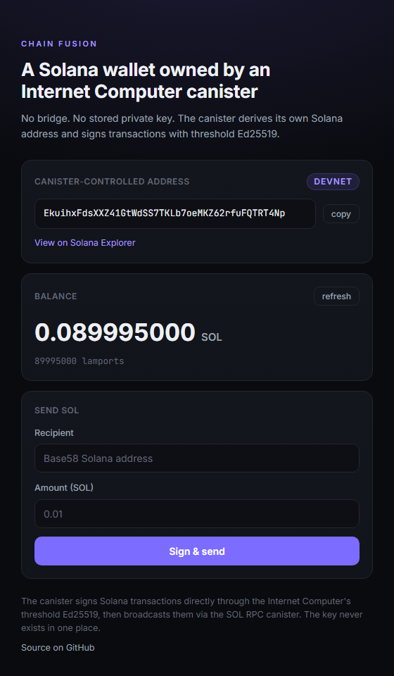

# Chain Fusion: a Solana wallet owned by an Internet Computer smart contract

An ICP canister that derives, holds, and spends its own Solana wallet using
threshold Ed25519 signing. **No bridge. No private key stored anywhere.**

The canister signs Solana transactions directly. Here is one it sent on devnet:
[`2tGygaNU...xHEZ5vrx`](https://explorer.solana.com/tx/2tGygaNUXLwiBFB32XMSRALqgEV49VKegJhuRartzW4YNEXdvBC7aHZMEwUH9Uk45uj4d2HnaXoM1MysxHEZ5vrx?cluster=devnet).

## Why this exists

To control a Solana wallet you normally need a private key sitting on a server
or in a browser extension. That key is the thing that gets leaked, and it is the
reason most cross-chain setups depend on bridges, which keep getting drained.

Chain Fusion removes the key. An Internet Computer canister derives its own
Solana address with **threshold Ed25519**: the private key never exists in one
place. It is split across the nodes of an ICP subnet and only assembled, in
pieces, at signing time. The same canister reads Solana state and broadcasts
transactions over RPC.

The result is a smart contract on one chain that holds and spends a wallet on
another, with no bridge and no stored key.

## What it does

- **Derives** the canister's own Solana address (threshold Ed25519)
- **Reads** its live SOL balance from Solana
- **Sends** SOL: it builds the transaction, signs it, and broadcasts it
- Returns a link to the resulting transaction on Solana explorer

## Frontend

A small web UI (served from an asset canister) shows the canister-controlled
Solana address and its live balance, and lets you send SOL through the canister.
Running against a local replica, reading a real devnet balance:



## Architecture

```
   caller
     |
     v
+-------------------+      schnorr_public_key / sign_with_schnorr
|  backend canister | ----------------------------------------> IC management canister
|     (Motoko)      |                                            (threshold Ed25519)
|                   |
|                   | --- getBalance (HTTPS outcall + transform) --> Solana RPC
|                   |
|                   | --- getSlot / getBlock / sendTransaction ---> SOL RPC canister --> Solana
+-------------------+
```

### A deliberate split on how RPC is done

This project talks to Solana two different ways, on purpose:

- **Balance (a stable read)** uses a direct HTTPS outcall with a transform
  function. The raw `getBalance` response includes a volatile `slot` that would
  break cross-replica consensus, so the transform strips everything except the
  lamport value, and every node then produces an identical response.

- **Sending** uses the official **SOL RPC canister**. A Solana transaction needs
  a fresh blockhash, but `getLatestBlockhash` returns a different value to every
  subnet node (it changes roughly every 400ms), so a raw outcall can never reach
  consensus on it. The SOL RPC canister solves this: `getSlot` is rounded down so
  the nodes converge on the same slot, then `getBlock` returns that slot's stable
  blockhash.

Knowing when a direct outcall is enough versus when you need the consensus-managed
RPC canister is the core design decision here.

## How the transaction is built

Motoko has no Solana SDK, so the transaction is serialized by hand:

- `base58` encode and decode (addresses, blockhash)
- `base64` encode (the wire transaction)
- Solana `compact-u16` (shortvec) length prefixes
- little-endian `u32` / `u64` (the `SystemProgram::Transfer` instruction data)
- the message layout: header, account keys, recent blockhash, and the instruction

The serialized message is signed with the canister's threshold Ed25519 key, the
signature is prepended, and the whole transaction is base64-encoded and submitted.

## Run it locally

Prerequisites: [`dfx`](https://internetcomputer.org/docs/building-apps/getting-started/install),
the Solana CLI, and a funded Solana devnet keypair.

```bash
# 1. start a local replica
dfx start --clean --background

# 2. pull and deploy the SOL RPC canister (a dependency)
dfx deps pull
dfx deps init sol_rpc --argument '(record {})'
dfx deps deploy

# 3. deploy this canister
dfx deploy backend

# 4. get the canister's Solana address
dfx canister call backend get_solana_address

# 5. fund that address with devnet SOL (the public faucet is unreliable;
#    a simple transfer from your own funded devnet wallet works):
solana transfer <ADDRESS_FROM_STEP_4> 0.1 --allow-unfunded-recipient

# 6. read the balance, then send some SOL back out
dfx canister call backend get_balance
dfx canister call backend send_sol '("<RECIPIENT_ADDRESS>", 10000000)'

# 7. (optional) deploy the web UI, then open it against your backend id
dfx deploy frontend
echo "open the printed frontend URL with ?backend=$(dfx canister id backend)"
```

`send_sol` returns the transaction signature and an explorer link. The web UI
reads the backend canister id from a `?backend=<id>` query parameter (falling
back to the default in `src/frontend/app.js`), so it still connects when a fresh
deploy assigns a different local id.

## Notes

- Locally, dfx provides a test threshold key (`dfx_test_key`). It produces real
  Ed25519 signatures that Solana devnet accepts, so the full flow works end to
  end from a local replica. On the IC mainnet the canister uses the production
  key (`key_1`), which derives a different address.
- The SOL RPC calls are pointed at the public devnet endpoint, so no provider API
  key is needed. The attached cycle amounts are generous and refunded; tune them
  with the `*CyclesCost` query methods for production.

## License

MIT. See [LICENSE](LICENSE).
